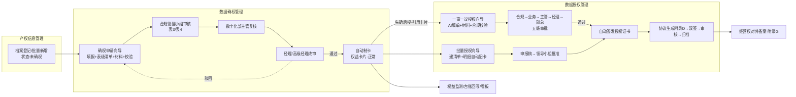

# 数据产权管理 · 用户工作流全景（E2E 实测验证版）

> 本文档非纸面梳理——2026-06-12 用 33 步 API 全链驱动**实际跑通后**编写，每条流转均经真实状态机验证（含真调 qwen3.7-max 的 AI 触点）。角色按附录F口径标注。

## 总览（一图流）

## 一、确权工作流（申请人 → 三级审批 → 制卡）

| 步 | 角色 | 页面 | 动作 | 系统行为/状态 |
|---|---|---|---|---|
| 1 | 数据专责 | 产权信息管理·档案 | 登记/批量新增资产 | 确权状态固定"未确权"（由流程驱动） |
| 2 | 申请人 | 确权申请向导·步骤1 | 搜资产(AST-001)→元数据填充(质量≥80)→权属多选→管制属性→A-J识别→表2→**表级清单M02 粘贴** | 暂存=MDAU 编号草稿；**权益归集判定**即时给出（实测规则3.1：管制+涉三方→经营权依权益判定） |
| 3 | 申请人 | 步骤2 | 按 A–J 应交清单上传 6 份材料（可调用智能工具解析） | 格式强校验、SM3 哈希 |
| 4 | 申请人 | 步骤3 | 规则校验（实测 6/6 全过）+ **AI 材料校验(qwen)** + AI 决策研判 | 门禁：校验全过才可推审 |
| 5 | 申请人 | 步骤3 提交 | 推送审核 | 状态：草稿→**合规审核中** |
| 6 | 合规管控小组 | 审核申请提交 | 审核通过（出表3/表4认定意见） | →**主管复核中** |
| 7 | 数字化部主管 | 审核申请提交 | 复核通过 | →**经理终审中** |
| 8 | 经理/高级经理 | 审核申请提交 | 终审通过 | →**已完成**；**自动生成权益卡片**（实测 EC-PRA-5DE9…·状态正常）并回写台账"已确权"；全程留痕 4 条 |

驳回分支：任一级驳回→"已驳回"+原因，申请人修改后重走；元数据质量<80 提交即自动驳回（实测 AST-LOWQ-1）。

## 二、一事一议授权工作流（先确后授 → 五级审批 → 发证 → 双签归档）

| 步 | 角色 | 页面 | 动作 | 系统行为/状态 |
|---|---|---|---|---|
| 1 | 申请人 | 一事一议向导·步骤1 | **AI 智能填单**（一句话→五要素）→选资产自动带生效卡片（先确后授一选三填）→补表单+材料 | 冻结/失效卡熔断（实测 FROZEN 拒绝） |
| 2 | 申请人 | 步骤2 | 合规校验 7 维（实测全绿）+ AI 材料校验 + **AI 合规预审** | 红灯不可提交 |
| 3 | 申请人 | 步骤3 | 提交审批 | →**合规审核中** |
| 4-8 | 合规小组→业务部门→数字化部主管→经理→**副总** | 授权审核提交 | 逐级通过（实测五级流转：合规审核中→业务审核中→主管审核中→经理审核中→副总审批中） | 终审→**已生效**；**自动签发授权证书**（实测 AC-PRA-F9C4…）；终审前二次校验卡片（审批期间冻结即熔断） |
| 9 | 双方 | 协议签章上传 | 按申请**生成附录D协议**→授权方签章→被授权方签章 | 实测双签 OK |
| 10 | 合规 | 协议审核提交 | 审核通过 | 实测 OK |
| 11 | 档案员 | 协议存档管理 | 归档 | 实测 OK；经营权另走附录G备案 |

## 三、批量授权工作流（清单制 → 领导小组批准）

建清单(表6头·年度) → 逐条加授权项（**三通道自动配卡**：手填搜索/目录多选/AI 批量填单）→ 提交申报稿 → 批量授权清单页**领导小组批准** → 双签附录D → 发证。实测：3 明细全自动配卡入单、申报→批准状态机正确、冻结卡在合规校验拦截。

## 四、智能确权辅助工具（独立工具，随时被调用）

- 业务调用点：确权向导步骤2/3（带 applyId）、冲突识别（带 assetId）、决策支持（自动研判）；
- 11 个大模型触点全部真调 qwen3.7-max 验证通过（材料解析/校验/冲突建议/RAG预测/意图填单/OCR/冲突检测/授权校验/预审×2/批量填单）。

## 五、监测与闭环

确权/授权生效 → 台账回写+变更留痕上链 → 权益监测（到期/越权预警→通知中心铃铛）→ 预警可触发证书熔断（suspend-by-asset）→ 看板呈现。
